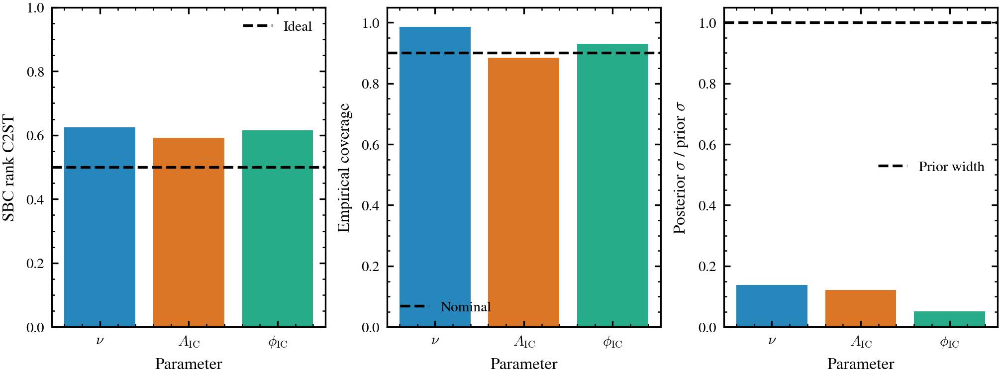
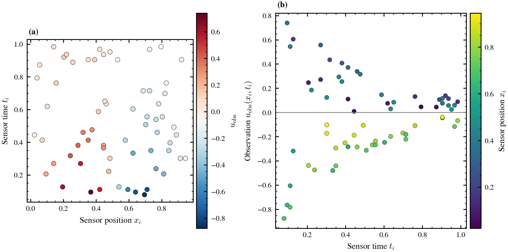
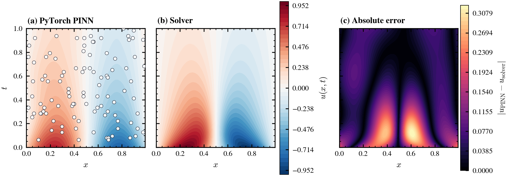

# Backend-Agnostic Inverse Burgers with Tesseract

[](https://github.com/pasteurlabs/tesseract-core)
[](https://github.com/pasteurlabs/tesseract-jax)
[](https://github.com/google/jax)
[](https://pytorch.org/)
[](LICENSE)
[](https://github.com/julian-8897/tesseract-pinn-inverse-burgers/actions/workflows/ci.yml)

**Overview**
This project estimates the viscosity coefficient of the 1D viscous Burgers
equation from sparse noisy observations, and showcases **Tesseract as a registry
of framework-agnostic, swappable, differentiable model components**. The physics
solver, the PINN surrogate, and the posterior sampler are each packaged as
an independent Tesseract behind one uniform typed schema — so you swap a JAX
component for a PyTorch one by changing an image name, with identical calling
code and no shared environment.

The inverse problem is solved two ways, both differentiating through a Tesseract:

- **Solver-adjoint inversion** (`--mode solver-inverse`): `jax.grad` flows through
  the differentiable **solver** Tesseract's VJP — a PDE-constrained baseline.
- **PINN inversion** (`--mode pinn`): `jax.grad` flows through the **PINN**
  Tesseract's VJP, with the PINN backend interchangeable between **JAX and
  PyTorch** (the backend-agnostic showcase).

`--mode compare` runs all three (solver-adjoint, PINN-JAX, PINN-PyTorch) on the
same physics and prints a unified table.

**Key implementations:**
- Three swappable, framework-agnostic Tesseracts: a JAX pseudospectral **solver**, a **PINN** with interchangeable JAX/PyTorch backends behind one `apply`/`vector_jacobian_product` contract, and an apply-only **FMPE posterior** sampler
- Two differentiable inverse methods (solver-adjoint and PINN) compared on identical physics
- Shared strategy-driven training engine; measured complete-epoch Tesseract apply/VJP telemetry
- Configurable loss weights, optional BRDR adaptive residual weighting, `log_nu` optimization, seeded runs, seed sweeps, reproducible artifacts
- Reproducible amortized flow-matching posterior over `(nu, ic_amp, ic_phase)`, packaged as the third swappable Tesseract with a versioned runtime contract

---

## Contents

- [Problem Statement](#problem-statement)
- [Implementation](#implementation)
- [Configuration](#configuration)
- [Installation](#installation)
- [Usage](#usage)
- [Results](#results)
- [Current Status](#current-status)
- [Limitations and Roadmap](#limitations-and-roadmap)
- [References](#references)

---

## Problem Statement

Given noisy observations of the 1D Burgers equation solution, infer the unknown viscosity parameter $\nu$:

$$
\frac{\partial u}{\partial t} + u \frac{\partial u}{\partial x} = \nu \frac{\partial^2 u}{\partial x^2}
$$

where:
- $u(x, t)$ is the velocity field on $[0, 1] \times [0, T]$
- $\nu$ is the kinematic viscosity (inferred parameter)
- Initial condition: $u(x, 0) = \sin(2\pi x)$
- Boundary conditions: periodic on $[0, 1]$

Synthetic observations come from a differentiable pseudospectral Burgers solver
with FFT spatial derivatives, 2/3 dealiasing, and adaptive Diffrax time
integration. The solver uses the same sinusoidal initial condition and periodic
boundary conditions as the PINN loss. The inverse pipeline samples noisy
observations from the nonlinear solution field with additive Gaussian noise,
using $\sigma = 0.02$ by default.

A physics-informed neural network (PINN) minimizes a combined loss function:

$$\mathcal{L} = \lambda_{\text{data}} \cdot \mathcal{L}_{\text{data}} + \lambda_{\text{physics}} \cdot \mathcal{L}_{\text{physics}} + \lambda_{\text{IC}} \cdot \mathcal{L}_{\text{IC}} + \lambda_{\text{BC}} \cdot \mathcal{L}_{\text{BC}}$$

where:
- $\mathcal{L}_{\text{data}}$: mean squared error between predictions and observations
- $\mathcal{L}_{\text{physics}}$: PDE residual at collocation points
- $\mathcal{L}_{\text{IC}}$: initial condition violation
- $\mathcal{L}_{\text{BC}}$: boundary condition violation

## Implementation

### Architecture

The PINN uses fixed Fourier feature encoding to mitigate spectral bias:

```
Input (x, t) ∈ ℝ²
    ↓
Fixed Fourier encoding: [x, t, sin(x·B_x), cos(x·B_x), sin(t·B_t), cos(t·B_t)]
    ↓
MLP: 130 → 64 → 64 → 64 → 1 (tanh activations)
    ↓
Output: u(x, t)
```

The Fourier frequencies are deterministic backend-independent constants. The
flattened trainable parameter vector contains only MLP weights and biases,
giving the JAX and PyTorch containers the same trainable-parameter contract.
Derivatives ($\partial u/\partial x$, $\partial u/\partial t$,
$\partial^2 u/\partial x^2$) are computed via automatic differentiation within
each Tesseract using the native framework's autograd: `jax.grad` for the JAX
backend and `torch.autograd.grad` for the PyTorch backend.

### Tesseract Endpoints

The inverse-training showcase exercises these `pinn_jax` and `pinn_pytorch` endpoints:

1. **apply(inputs)**: Forward pass returning u_pred, u_x, u_t, u_xx
2. **vector_jacobian_product(...)**: Reverse-mode AD for gradient computation

JVP endpoints are secondary to the current demo because the inverse trainer uses
reverse-mode gradients through `jax.value_and_grad`. The `burgers_solver`
Tesseract implements the same `apply`, VJP, and JVP endpoint pattern for
differentiable solver runs. `--mode solver-inverse` differentiates through its
VJP during optimization; the same solver implementation also generates
observations, FMPE simulations, and visualization fields.

Input/output schemas use Tesseract's `Differentiable[Array[...]]` annotations to declare which fields participate in autodiff.

### Cross-Framework Gradient Flow

The CLI path in `inverse_problem.py` optimizes the viscosity in log space:

```python
# Load backend (JAX or PyTorch)
pinn = Tesseract.from_image("pinn_jax")  # or "pinn_pytorch"

# One reverse-mode pass returns loss and both optimized gradients.
loss_and_grads = jax.value_and_grad(_loss_from_log_and_params, argnums=(0, 1))
loss, (log_nu_grad, params_grad) = loss_and_grads(log_nu, params, ..., pinn)

# The objective evaluates the PDE residual with nu = exp(log_nu).
# When jax.value_and_grad runs, it triggers Tesseract's VJP endpoint.
# For PyTorch backend: Tesseract VJP internally uses torch.autograd.grad
# For JAX backend: Tesseract VJP internally uses jax.grad
```

> **Key point:** The system-level gradients
> ($\partial \mathcal{L}/\partial \log\nu$ and
> $\partial \mathcal{L}/\partial \text{params}$) use Tesseract's
> `vector_jacobian_product` endpoint for both backends. The backend selection
> determines which autograd implementation Tesseract uses inside the VJP
> computation.

The inverse loop optimizes `log_nu` and evaluates the PDE residual with
`nu = exp(log_nu)`. This keeps the inferred viscosity positive. Optional
viscosity clipping and viscosity warmup are available through `TrainingConfig`
and the Streamlit app for more stable interactive runs.

### Shared Training Engine

`inverse_problem.py` exposes `train_inverse(config, *, pinn=None, callback=None,
metrics_every=20)`. Both the CLI and Streamlit UI call this function. Presentation
is delegated to callbacks:

- `RichProgressCallback` renders CLI progress and final tables.
- `MetricsRecorderCallback` records per-epoch metrics for CLI artifacts.
- `StreamlitTrainingCallback` drives the app's live plots and trace panels.

Each optimization step uses one `jax.value_and_grad` over `(log_nu, params)`.
`TesseractCallCounter` wraps the `tesseract_jax` dispatch layer to report real
container calls across the complete epoch. Counts include the optimization pass,
optional BRDR pointwise-loss preparation, and periodic component-metric
evaluation, so metric epochs can contain more `apply` calls than ordinary epochs.

### Configuration

Run settings live in validated typed dataclasses in `configs.py`:

- `ProblemConfig`: true viscosity, initial viscosity, and domain
- `DataConfig`: observation count, noise level, and seed
- `TrainingConfig`: epochs, learning rates, collocation/IC/BC sample counts, BRDR settings, optional viscosity warmup, and optional viscosity clipping
- `LossWeights`: data, physics, initial-condition, and boundary-condition weights
- `RunConfig`: full run configuration consumed by `inverse_problem.py`
- `FMPEConfig`: simulation count, sensor count, noise, prior bounds, device, and
  independent sensor/simulation/training seeds for posterior training

The CLI exposes the common knobs directly. Internally, `inverse_problem.py`
converts CLI arguments into a `RunConfig`, so Streamlit, tests, and figure
scripts call the same training path without duplicating defaults.

### Project Structure

```
tesseract-pinn-inverse-burgers/
├── component_loader.py        # Conflict-free local Tesseract API loading
├── configs.py                 # Deterministic inverse and FMPE configurations
├── inverse_problem.py         # Deterministic inverse methods and shared engine
├── fmpe_posterior.py          # FMPE simulation, training, bundles, diagnostics
├── app.py                     # Streamlit interactive interface
├── buildall.sh                # Builds Docker containers for all Tesseracts
├── Makefile                   # Common verification and demo commands
├── pyproject.toml
├── scripts/
│   ├── fmpe_diagnostics.py    # SBC/TARP and contraction-study CLI
│   ├── ml_plot_style.py       # Shared SciencePlots ML-publication style
│   ├── plot_sbi_results.py    # Posterior and calibration figures
│   └── regenerate_figures.py  # PINN figures from the current training path
├── tests/                     # Unit tests plus optional container smoke test
└── tesseracts/
    ├── burgers_solver/
    │   ├── tesseract_api.py        # Differentiable pseudospectral Burgers solver
    │   ├── tesseract_config.yaml
    │   └── tesseract_requirements.txt
    ├── pinn_jax/
    │   ├── tesseract_api.py        # JAX/Equinox PINN with Tesseract endpoints
    │   ├── tesseract_config.yaml
    │   └── tesseract_requirements.txt
    ├── pinn_pytorch/
    │   ├── tesseract_api.py        # PyTorch PINN with Tesseract endpoints
    │   ├── tesseract_config.yaml
    │   └── tesseract_requirements.txt
    └── fmpe_posterior/
        ├── tesseract_api.py        # Validated apply-only posterior sampler
        ├── tesseract_config.yaml
        └── tesseract_requirements.txt
```

---

## Installation

**Requirements:** Python >=3.13, Docker, and the Tesseract CLI.

```bash
# Clone repository
git clone https://github.com/julian-8897/tesseract-pinn-inverse-burgers.git
cd tesseract-pinn-inverse-burgers

# Install Python dependencies from pyproject.toml / uv.lock
uv sync

# Build Tesseract containers (requires Docker running).
# fmpe_posterior is skipped until its gitignored posterior.pkl is trained.
./buildall.sh

# Optional: train the posterior model, then build the fmpe_posterior Tesseract
make train-posterior
uv run tesseract build tesseracts/fmpe_posterior

# Verify built images
docker images | grep -E 'burgers_solver|pinn|fmpe_posterior'
```

`pyproject.toml` and `uv.lock` are the dependency source of truth. No separate
`requirements.txt` is maintained.

---

## Usage

### CLI

```bash
# Compare inverse methods: solver-adjoint vs PINN (JAX & PyTorch), one table
uv run python inverse_problem.py --mode compare --epochs 100 --seed 123

# Solver-adjoint inversion (jax.grad through the solver Tesseract VJP)
uv run python inverse_problem.py --mode solver-inverse --epochs 80

# PINN inversion: compare both backends
uv run python inverse_problem.py --backend both --epochs 100

# PINN inversion: single backend
uv run python inverse_problem.py --backend jax --epochs 50
uv run python inverse_problem.py --backend pytorch --epochs 50

# Reproducible single-seed run
uv run python inverse_problem.py --backend jax --epochs 50 --seed 123

# Override PINN loss weights
uv run python inverse_problem.py --backend jax --epochs 50 \
  --w-data 1.0 --w-physics 0.2 --w-ic 0.5 --w-bc 0.5

# Use BRDR pointwise adaptive loss weights
uv run python inverse_problem.py --backend jax --epochs 100 \
  --adaptive-loss-weights

# Seed sweep with summary statistics
uv run python inverse_problem.py --backend jax --epochs 50 --seeds 0 1 2 3 4

# Write reproducible benchmark artifacts
uv run python inverse_problem.py --backend both --epochs 100 --seed 123 --out runs
```

When `--out` is set, the CLI writes artifacts under
`runs/<timestamp>/<backend>/`:

- `config.json`: JSON-serializable `RunConfig`
- `metrics.csv`: per-epoch viscosity, loss, gradient norms, timings, and measured Tesseract call counts
- `summary.json`: final scalar results and apply/VJP calls per step

### Streamlit

```bash
uv run streamlit run app.py
```

The app exposes all three swappable Tesseracts behind one sidebar **method**
selector — each method makes a *different* Tesseract the active boundary of the
same inverse problem:

- **Solver-adjoint inversion** — optimize `log_nu` by differentiating the data-fit
  loss through the `burgers_solver` Tesseract VJP (the PDE-constrained baseline);
  live convergence plus the recovered solver field vs. ground truth. *Requires the
  `burgers_solver` image.*
- **PINN inversion (JAX ↔ PyTorch)** — the cross-framework showcase: adjustable
  hyperparameters/sampling/loss weights, viscosity warmup and clipping, optional
  BRDR adaptive weighting with mean-weight plots, a Tesseract trace panel with
  measured apply/VJP call counts, PINN-vs-solver field plots, and a JAX/PyTorch
  backend consistency report. *Requires the `pinn_jax` / `pinn_pytorch` images.*
- **FMPE posterior (UQ)** — pick a ground-truth `(nu, ic_amp, ic_phase)`; the solver
  builds a noisy observation at the trained sensor layout and the apply-only
  `fmpe_posterior` Tesseract returns a full posterior in one forward pass, rendered
  as marginals, a corner plot, a coverage summary, and the calibration caveat. *Runs
  fully in-process — no Docker image required, only the trained `posterior.pkl`.*

The CLI is the reference path for dataclass configs and seeded runs; the app and
CLI share the same callback-driven training engines (`train_inverse`,
`train_solver_inverse`) and the same packaged `fmpe_posterior` component.

### Uncertainty quantification (amortized flow-matching posterior)

Beyond the point estimates above, an amortized **Flow Matching Posterior
Estimation** (FMPE, via `sbi` + `zuko`) gives a posterior over the Burgers
parameters `(nu, ic_amp, ic_phase)` from a sparse observation vector. The trained
flow is packaged as the **third swappable Tesseract** (`fmpe_posterior`), alongside
the JAX solver and the JAX/PyTorch PINN.

```bash
# Train deterministically and persist a versioned model bundle
uv run python fmpe_posterior.py train --n-sims 10000 \
  --sensor-seed 0 --simulation-seed 0 --training-seed 1

# Build the posterior Tesseract (needs the trained posterior.pkl from `train`)
uv run tesseract build tesseracts/fmpe_posterior

# Query the posterior for an observation, via the container
uv run python fmpe_posterior.py demo --tesseract --nu 0.05

# Run SBC/TARP plus held-out coverage and contraction metrics
uv run python -m scripts.fmpe_diagnostics calibrate \
  --model tesseracts/fmpe_posterior/posterior.pkl

# Retrain over a sensor/noise grid and write a contraction table
uv run python -m scripts.fmpe_diagnostics contraction \
  --sensor-counts 16 32 64 --noise-levels 0.01 0.02 0.05
```

Saved bundles contain the prior, expected observation length, parameter order,
solver-grid contract, sensor-layout hash, training seeds, and a model identifier.
Both the host loader and Tesseract reject incompatible observation vectors.

Reference runs recover `nu` with the 90% credible interval containing truth,
with calibrated joint TARP coverage and acceptable IC-parameter marginals. The
`nu` marginal remains mildly overconfident (SBC c2st approximately 0.63), so the
posterior should not be described as fully calibrated.

### Publication figures

Both figure scripts use `scripts/ml_plot_style.py`, a neutral ML-publication
style built on SciencePlots. It provides compact single- and double-column
dimensions, inward ticks, embedded PDF fonts, high-resolution PNG output, and
basic validation for missing labels, plot titles, grids, and undersized lines.
The dimensions and aspect ratios are intended for NeurIPS/ICML-style papers
rather than a venue-specific journal template.

```bash
# SBI posterior, sensor layout, and calibration figures
make plot-sbi

# Rerender the exact saved posterior draw and include contraction diagnostics
uv run python -m scripts.plot_sbi_results \
  --samples-npz img/sbi/fmpe_posterior_samples.npz \
  --calibration-report artifacts/fmpe_calibration.json \
  --contraction-csv artifacts/fmpe_contraction.csv

# Retrain both PINN backends and regenerate the deterministic comparison figures
uv run python -m scripts.regenerate_figures \
  --epochs 100 --seed 123 --nx 160 --nt 90
```

Every plotted figure is exported as both `.png` and `.pdf`. The SBI sample
artifact records the exact posterior draw, truth, observation vector, sensor
indices, model identifier, and query source used for rendering.

### Tests

```bash
make compile
make lint
make test       # fast suite; excludes FMPE retraining
make test-slow  # tiny end-to-end FMPE training smoke
make smoke
```

`make smoke` runs the live container round-trip test and skips cleanly when the
local Tesseract images have not been built.

---

## Results
The repository includes regenerated SBI and deterministic PINN figures from the
current implementation. All plots use the shared ML-publication style and are
available as review PNGs and vector PDFs.

### SBI posterior and diagnostics

The FMPE posterior plot was generated by querying the packaged
`fmpe_posterior` Tesseract. The calibration panel summarizes the tracked
200-case reference evaluation. PDF versions are stored beside the PNG review
copies.

<table align="center" cellpadding="12">
  <tr>
    <td align="center">
      
      <div><em>Posterior marginals and pairwise structure for a synthetic truth at ν=0.05, A<sub>IC</sub>=1, and φ<sub>IC</sub>=0. Dashed lines mark truth.</em></div>
    </td>
  </tr>
  <tr>
    <td align="center">
      
      <div><em>Reference-posterior diagnostics over 200 held-out simulations. The viscosity rank statistic shows the documented mild overconfidence.</em></div>
    </td>
  </tr>
</table>

The sensor-layout panel documents the fixed conditioning design. Panel (a)
maps each sensor coordinate $(x_i,t_i)$ to its observed value. Panel (b) plots
$u_{\mathrm{obs}}(x_i,t_i)$ against observation time and colors points by
spatial position, avoiding an arbitrary sensor-index axis.

<p align="center">
  
  <br>
  <em>Fixed FMPE conditioning layout and the corresponding observations as a function of sensor time.</em>
</p>

`img/sbi/fmpe_contraction.png` is an exploratory 1,000-simulation-per-setting
sweep. It does not show monotonic contraction and should not be used as the
headline calibration result; the script is intended for a larger production
sweep.

### Deterministic PINN comparison

The deterministic figures were produced with both PINN Tesseract backends,
100 training epochs, seed 123, and a 160 x 90 visualization grid. Both runs use
the same observations, outer JAX/Optax optimizer, and inverse-problem
configuration.

<table align="center" cellpadding="12">
  <tr>
    <td align="center">
      
      <div><em>Backend comparison: viscosity trajectory, training objective, final viscosity estimates, and measured apply/VJP calls in the final epoch.</em></div>
    </td>
  </tr>
</table>

PINN $u(x,t)$ field reconstructions against the pseudospectral Burgers solver
ground truth. The PINN and solver panels share a symmetric field scale; the
third panel reports pointwise absolute error. Equal axis scaling preserves the
physical $(x,t)$ domain.

<table align="center" cellpadding="12">
  <tr>
    <td align="center">
      
      <div><em>JAX PINN reconstruction vs solver ground truth with shared field color scale and absolute error.</em></div>
    </td>
  </tr>
</table>

<table align="center" cellpadding="12">
  <tr>
    <td align="center">
      
      <div><em>PyTorch PINN reconstruction vs solver ground truth through the same JAX/Optax outer loop.</em></div>
    </td>
  </tr>
</table>

Vector versions: [backend comparison](img/pinn_solution_comparison.pdf),
[JAX field](img/pinn_field_solution_jax.pdf),
[PyTorch field](img/pinn_field_solution_pytorch.pdf),
[FMPE posterior](img/sbi/fmpe_posterior.pdf),
[sensor layout](img/sbi/fmpe_sensor_observations.pdf), and
[calibration diagnostics](img/sbi/fmpe_calibration.pdf). The exploratory
[contraction sweep](img/sbi/fmpe_contraction.pdf) is also available separately.

## Current Status

- Two differentiable inverse methods: **solver-adjoint** (`--mode solver-inverse`, `jax.grad` through the solver VJP) and **PINN** (`--mode pinn`, `jax.grad` through the PINN VJP); `--mode compare` tabulates both.
- For scalar viscosity inversion the solver-adjoint method is dramatically more accurate and cheaper per step than the PINN; the PINN is mesh-free and needs no solver but converges more slowly. The two PINN backends (JAX, PyTorch) agree, demonstrating backend-agnostic consistency.
- Each step uses one `jax.value_and_grad`; complete-epoch Tesseract apply/VJP counts are measured through the `tesseract_jax` dispatch layer.
- Loss weights can be fixed or adapted with opt-in BRDR pointwise residual weighting; the CLI and Streamlit app share callback-driven training engines.
- Stage B SBI is implemented: FMPE jointly infers `(nu, ic_amp, ic_phase)`, supports deterministic training, emits a validated versioned model bundle, and has tracked SBC/TARP and contraction tooling.
- Container smoke coverage verifies `Tesseract.from_image(...)` through `apply` and VJP when local images are available; reproducible artifacts and figures are supported.

## Limitations and Roadmap

- **FMPE calibration caveat:** Stage B posterior inference is implemented, but the `nu` marginal is mildly overconfident in reference SBC diagnostics. Joint TARP coverage and the IC marginals are stronger.
- **Point-estimate scope:** deterministic inversion still optimizes only viscosity `nu`; the FMPE posterior already treats `ic_amp` and `ic_phase` as nuisance parameters and infers all three jointly.
- **Optional Stage C:** solver-gradient refinement of FMPE samples through the solver VJP has not been implemented.
- **Model-misspecification sidebar (experimental):** a KdV-Burgers truth oracle (`solve_kdv_burgers`) plus a learned-discrepancy hybrid (`train_hybrid_inverse`) are included to *demonstrate* a known failure mode — naive calibration-with-discrepancy is confounded with the calibration parameter and biases it (Brynjarsdóttir & O'Hagan, 2014). This is documented as a limitation, not a headline result, and motivates the posterior treatment above.
- **No checkpointing; PINN model reconstructed from `params_flat` per call.**

## References

**Tesseract Documentation:**
- [Tesseract Core](https://github.com/pasteurlabs/tesseract-core) - Main repository and CLI
- [Tesseract-JAX](https://github.com/pasteurlabs/tesseract-jax) - JAX integration layer
- [Creating Tesseracts](https://docs.pasteurlabs.ai/projects/tesseract-core/latest/content/creating-tesseracts/create.html) - Implementation guide
- [Differentiable Programming](https://docs.pasteurlabs.ai/projects/tesseract-core/latest/content/introduction/differentiable-programming.html) - VJP/JVP concepts

**Related Publications to PINNs:**
- Raissi, M., Perdikaris, P., & Karniadakis, G. E., ["Physics-informed neural networks: A deep learning framework for solving forward and inverse problems involving nonlinear partial differential equations"](https://www.sciencedirect.com/science/article/pii/S0021999118307125), *Journal of Computational Physics* 378 (2019): 686-707
- Tancik, M., Srinivasan, P. P., Mildenhall, B., Fridovich-Keil, S., Raghavan, N., Singhal, U., Ramamoorthi, R., & Ng, R., ["Fourier Features Let Networks Learn High Frequency Functions in Low Dimensional Domains"](https://arxiv.org/abs/2006.10739), *NeurIPS* 2020

---

## Compatibility

| Component | Version | Notes |
|-----------|---------|-------|
| tesseract-core | 1.2.0 | Runtime and CLI |
| tesseract-jax | 0.2.3 | JAX integration |
| Python | >=3.13 | Project requirement in `pyproject.toml` |
| Docker | latest | Container execution |
| JAX | 0.8.2 | CPU backend |
| PyTorch | 2.9.1 | PyTorch backend |
| Equinox | 0.13.2 | JAX PINN modules |
| Optax | 0.2.6 | JAX optimizer |

**Tested platforms:** macOS (Apple Silicon)

---

## License

Licensed under [Apache License 2.0](LICENSE).
