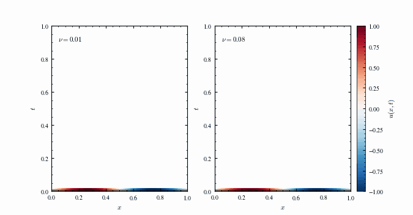
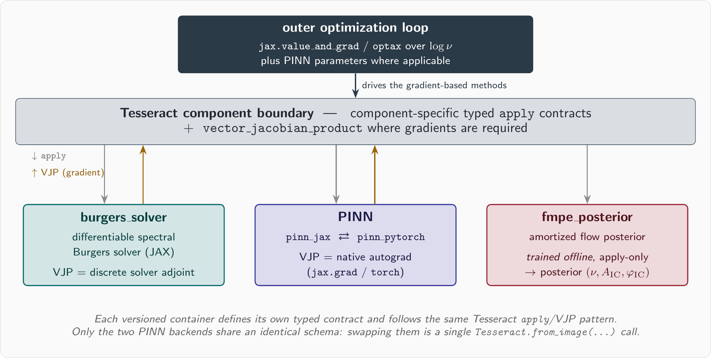
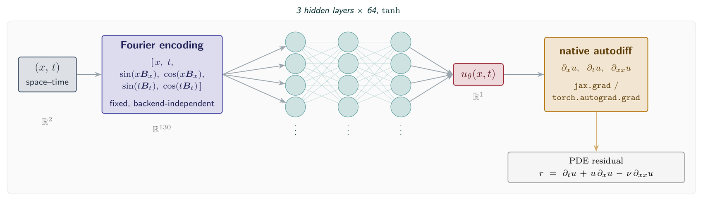
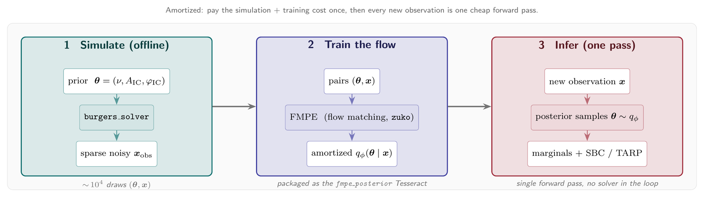
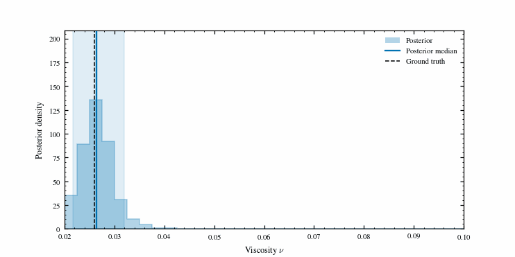
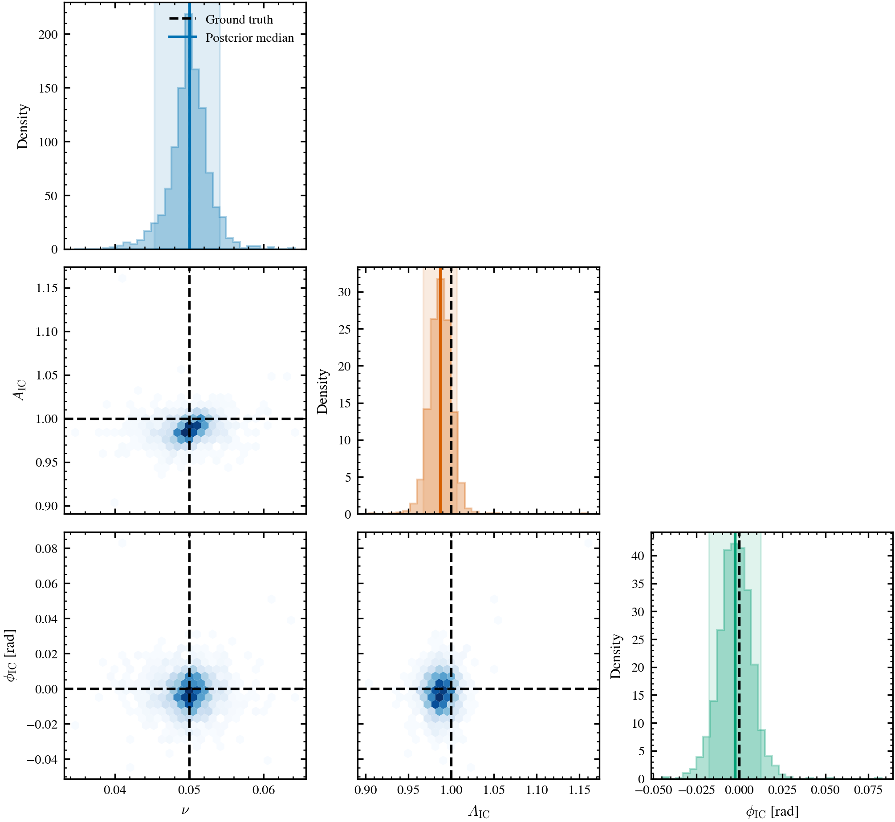
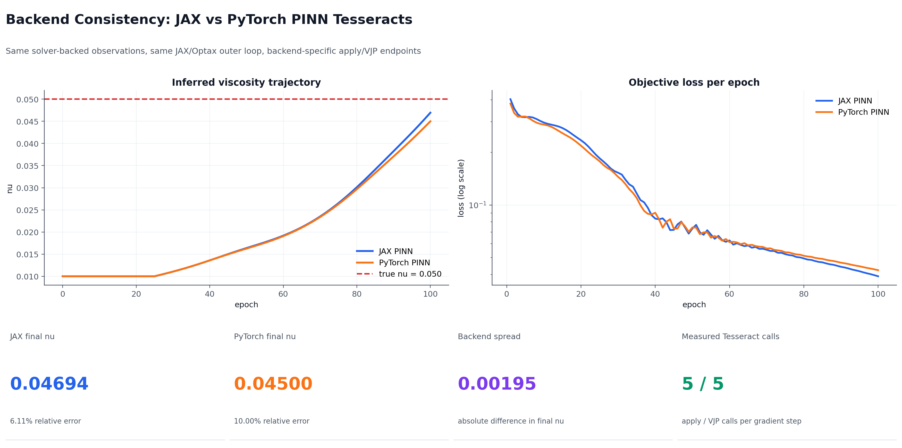
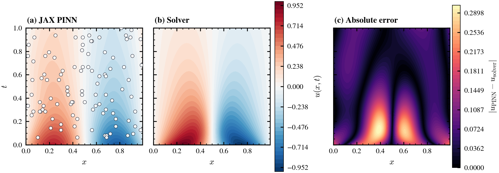

# Inverse Burgers with Tesseract

[](https://github.com/pasteurlabs/tesseract-core)
[](https://github.com/pasteurlabs/tesseract-jax)
[](https://github.com/google/jax)
[](https://pytorch.org/)
[](LICENSE)
[](https://github.com/julian-8897/tesseract-pinn-inverse-burgers/actions/workflows/ci.yml)

Recover the viscosity of 1D Burgers equation from sparse, noisy measurements with three different methods, with each of them packaged as a swappable
[Tesseract](https://github.com/pasteurlabs/tesseract-core) component.

<p align="center">
  
  <br>
  <em><b>The forward problem, as a space-time diagram.</b> Time runs upward and the
  field u(x, t) fills in as the solver integrates. At low viscosity (left) the wave
  steepens into a sharp shock, the near-vertical red/blue interface near x = 0.5; at
  high viscosity (right) the same wave diffuses. The inverse problem is to
  recover that viscosity from sparse samples of this field.</em>
</p>

## The problem

The viscous Burgers equation describes a 1D fluid whose sharp fronts smear out over
time, at a rate set by a single number: the viscosity ν. You see the fluid only through
sparse, noisy point measurements of its velocity field, and ν is unknown. The task is
to recover it.

The field $u(x, t)$ evolves by

```math
\frac{\partial u}{\partial t} + u \frac{\partial u}{\partial x} = \nu \frac{\partial^2 u}{\partial x^2}
```

- $u(x, t)$: velocity field on the domain $[0, 1] \times [0, T]$
- $\nu$: kinematic viscosity, the unknown to infer
- initial condition $u(x, 0) = \sin(2\pi x)$
- periodic boundaries on $[0, 1]$

The observations are synthetic, generated via a differentiable pseudospectral solver (FFT spatial derivatives, 2/3
dealiasing, adaptive Diffrax time stepping), sampled at sparse space–time points with
additive Gaussian noise ($\sigma = 0.02$ by default). Because the data comes from the
true dynamics, the solver-adjoint method below recovers ν down to the noise floor and
gives the other two methods a near-exact reference to check against.

## Three methods for the inverse problem

1. **Solver-adjoint.** Run a differentiable spectral Burgers solver, compare its output
   to the data, and let `jax.grad` move ν downhill through the solver's VJP, which is
   the PDE adjoint. Accurate and cheap per step. It needs the solver in the loop.
2. **PINN.** Train a neural network to satisfy the PDE and fit the data at once, then
   read ν off the trained model. No solver required at inference. The same network ships as
   `pinn_jax` and `pinn_pytorch` behind a single contract, so changing backend is a simple swap.
3. **Amortized posterior (FMPE).** Trade the point estimate for a distribution. A
   flow-matching network, trained offline on simulations, reads one observation and
   returns a posterior over `(nu, ic_amp, ic_phase)` in a single forward pass.

## What this repo does

Each of those three methods is packaged as a
[Tesseract](https://github.com/pasteurlabs/tesseract-core): a container exposing a
typed `apply` interface plus a `vector_jacobian_product` where gradients are needed.
Every method uses that same interface, so switching between them (a JAX component for
a PyTorch one, or a point estimate for a full posterior) is a one-liner that
leaves the optimization loop untouched!:

```python
pinn = Tesseract.from_image("pinn_jax")      # JAX / Equinox
pinn = Tesseract.from_image("pinn_pytorch")  # PyTorch; nothing else changes, same ν
```

That swappability is the overall goal. One `jax.grad`-based outer loop drives the JAX
solver, the JAX or PyTorch PINN, and the flow-matching posterior neural net, because each is a
versioned, framework-agnostic component behind the same contract.

<p align="center">
  
</p>

Each component is a versioned container with a typed IO schema and VJP/JVP endpoints.
The JAX loop differentiates through a PyTorch model in a separate runtime, and you can
pin a component to a version or serve it remotely without touching the caller. The swap
is one image name because the loop depends only on the contract.

### Scalability

The outer loop never refers to Burgers equation. It differentiates a parameter through a
Tesseract's `apply`/VJP, so it drives any differentiable forward model, from another PDE
to a renderer. Point it at a new simulator with its own typed inputs and the
solver-adjoint method carries over; the PINN and posterior methods reuse the same
surrogate and amortized-inference recipe. You rewrite only the physics problem (the forward
model, the network or prior, the sensor layout, the calibration); the loop and the
same contract is intact.

## Quickstart

```bash
git clone https://github.com/julian-8897/tesseract-pinn-inverse-burgers.git
cd tesseract-pinn-inverse-burgers
uv sync
./buildall.sh    # build the solver and PINN Tesseract images (needs Docker)
```

Open the interactive demo:

```bash
uv run streamlit run app.py
```

Or compare the two deterministic methods from the command line:

```bash
uv run burgers-inverse --mode compare --epochs 100 --seed 123
```

The posterior method needs an additional step, `make train-posterior`, covered in
[Uncertainty quantification](#uncertainty-quantification-amortized-flow-matching-posterior).

---

## Implementation

### The PINN network

The PINN uses fixed Fourier feature encoding to mitigate spectral bias:

<p align="center">
  
</p>

The Fourier frequencies are deterministic backend-independent constants. The
flattened trainable parameter vector contains only MLP weights and biases,
giving the JAX and PyTorch containers the same trainable-parameter contract.
Derivatives ($\partial u/\partial x$, $\partial u/\partial t$,
$\partial^2 u/\partial x^2$) are computed via automatic differentiation within
each Tesseract using the native framework's autograd: `jax.grad` for the JAX
backend and `torch.autograd.grad` for the PyTorch backend.

The PINN method trains this network by minimizing a combined loss that fits the data
and enforces the physics at once:

```math
\mathcal{L} = \lambda_{\text{data}} \cdot \mathcal{L}_{\text{data}} + \lambda_{\text{physics}} \cdot \mathcal{L}_{\text{physics}} + \lambda_{\text{IC}} \cdot \mathcal{L}_{\text{IC}} + \lambda_{\text{BC}} \cdot \mathcal{L}_{\text{BC}}
```

where $\mathcal{L}_{\text{data}}$ is the mean squared error against observations,
$\mathcal{L}_{\text{physics}}$ is the PDE residual at collocation points, and
$\mathcal{L}_{\text{IC}}$, $\mathcal{L}_{\text{BC}}$ penalize initial- and
boundary-condition violations. The viscosity ν enters through
$\mathcal{L}_{\text{physics}}$, so the same backward pass that trains the network also
moves ν.

### What each Tesseract exposes

Both PINN containers (`pinn_jax` and `pinn_pytorch`) expose the same two endpoints:

1. `apply(inputs)`: the forward pass, returning `u_pred`, `u_x`, `u_t`, and `u_xx`.
2. `vector_jacobian_product(...)`: reverse-mode AD for the gradient.

The inverse trainer uses reverse-mode gradients through `jax.value_and_grad`, so
the JVP endpoints stay idle here. The `burgers_solver`
Tesseract implements the same `apply`, VJP, and JVP endpoint pattern for
differentiable solver runs. `--mode solver-inverse` differentiates through its
VJP during optimization; the same solver implementation also generates
observations, FMPE simulations, and visualization fields.

Input/output schemas use Tesseract's `Differentiable[Array[...]]` annotations to declare which fields participate in autodiff.

### How a JAX gradient reaches PyTorch

The CLI path in `burgers_inverse.cli` optimizes the viscosity in log space:

```python
# Load backend (JAX or PyTorch)
pinn = Tesseract.from_image("pinn_jax")  # or "pinn_pytorch"

# One reverse-mode pass returns loss and both optimized gradients.
loss_and_grads = jax.value_and_grad(_loss_from_log_and_params, argnums=(0, 1))
loss, (log_nu_grad, params_grad) = loss_and_grads(log_nu, params, ..., pinn)

# The objective evaluates the PDE residual with nu = exp(log_nu).
# When jax.value_and_grad runs, it triggers Tesseract's VJP endpoint.
# For PyTorch backend: Tesseract VJP internally uses torch.autograd.grad
# For JAX backend: Tesseract VJP internally uses jax.grad
```

> **Key point:** both backends compute the system-level gradients
> ($\partial \mathcal{L}/\partial \log\nu$ and
> $\partial \mathcal{L}/\partial \text{params}$) through Tesseract's
> `vector_jacobian_product` endpoint. The backend image only selects which autograd
> runs inside that VJP: `jax.grad` or `torch.autograd.grad`.

The inverse loop optimizes `log_nu` and evaluates the PDE residual with
`nu = exp(log_nu)`. This keeps the inferred viscosity positive. Optional
viscosity clipping and viscosity warmup are available through `TrainingConfig`
and the Streamlit app for more stable interactive runs.

### One engine, many front ends

`burgers_inverse.engine` exposes `train_inverse(config, *, pinn=None, callback=None,
metrics_every=20)`. Both the CLI and Streamlit UI call this function. Presentation
is delegated to callbacks:

- `RichProgressCallback` renders CLI progress and final tables.
- `MetricsRecorderCallback` records per-epoch metrics for CLI artifacts.
- `StreamlitTrainingCallback` drives the app's live plots and trace panels.

Each optimization step uses one `jax.value_and_grad` over `(log_nu, params)`.
`TesseractCallCounter` wraps the `tesseract_jax` dispatch layer to report real
container calls across the complete epoch. Counts include the optimization pass,
optional BRDR pointwise-loss preparation, and periodic component-metric
evaluation, so metric epochs can contain more `apply` calls than ordinary epochs.

### Configuration

Run settings live in validated typed dataclasses in `burgers_inverse/configs.py`:

- `ProblemConfig`: true viscosity, initial viscosity, and domain
- `DataConfig`: observation count, noise level, and seed
- `TrainingConfig`: epochs, learning rates, collocation/IC/BC sample counts, BRDR settings, optional viscosity warmup, and optional viscosity clipping
- `LossWeights`: data, physics, initial-condition, and boundary-condition weights
- `RunConfig`: full run configuration consumed by the inverse engine
- `FMPEConfig`: simulation count, sensor count, noise, prior bounds, device, and
  independent sensor/simulation/training seeds for posterior training

The CLI exposes the common knobs directly. Internally, `burgers_inverse.cli`
converts CLI arguments into a `RunConfig`, so Streamlit, tests, and figure
scripts call the same training path without duplicating defaults.

### Repository layout

```
tesseract-pinn-inverse-burgers/
├── src/burgers_inverse/       # Installable library package
│   ├── configs.py             # Typed, validated inverse + FMPE configurations
│   ├── constants.py           # Shared solver/sensor discretization grid
│   ├── component_loader.py    # Conflict-free local Tesseract API loading
│   ├── components.py          # Tesseract access, image guards, field evaluation
│   ├── observations.py        # Solver-backed observation samplers
│   ├── losses.py              # PINN loss components + BRDR adaptive weighting
│   ├── engine.py              # Shared inverse-training engine (Strategy + Factory)
│   ├── experimental.py        # KdV/discrepancy sidebar (documented negative result)
│   ├── reporting.py           # Console tables, progress callbacks, run artifacts
│   ├── cli.py                 # Command-line orchestration (burgers-inverse)
│   └── fmpe_posterior.py      # FMPE simulation, training, bundles, diagnostics
├── app.py                     # Streamlit interactive interface
├── buildall.sh                # Builds Docker containers for all Tesseracts
├── Makefile                   # Common verification and demo commands
├── pyproject.toml
├── scripts/
│   ├── fmpe_diagnostics.py    # SBC/TARP and contraction-study CLI
│   ├── ml_plot_style.py       # Shared SciencePlots ML-publication style
│   ├── plot_sbi_results.py    # Posterior and calibration figures
│   └── regenerate_figures.py  # PINN figures from the current training path
├── tests/                     # Unit tests plus optional container smoke test
└── tesseracts/
    ├── burgers_solver/
    │   ├── tesseract_api.py        # Differentiable pseudospectral Burgers solver
    │   ├── tesseract_config.yaml
    │   └── tesseract_requirements.txt
    ├── pinn_jax/
    │   ├── tesseract_api.py        # JAX/Equinox PINN with Tesseract endpoints
    │   ├── tesseract_config.yaml
    │   └── tesseract_requirements.txt
    ├── pinn_pytorch/
    │   ├── tesseract_api.py        # PyTorch PINN with Tesseract endpoints
    │   ├── tesseract_config.yaml
    │   └── tesseract_requirements.txt
    └── fmpe_posterior/
        ├── tesseract_api.py        # Validated apply-only posterior sampler
        ├── tesseract_config.yaml
        └── tesseract_requirements.txt
```

---

## Installation

**Requirements:** Python >=3.13, Docker, and the Tesseract CLI. The
[Quickstart](#quickstart) covers the basics (`uv sync` then `./buildall.sh`).
`pyproject.toml` and `uv.lock` are the only dependency source; there is no
`requirements.txt`.

`buildall.sh` skips `fmpe_posterior` until its weights exist, so the posterior
method needs one extra step (the trained `posterior.pkl` is gitignored):

```bash
# Train the posterior, then build its Tesseract
make train-posterior
uv run tesseract build tesseracts/fmpe_posterior

# Confirm the images are present
docker images | grep -E 'burgers_solver|pinn|fmpe_posterior'
```

---

## Usage

### CLI

```bash
# Compare inverse methods: solver-adjoint vs PINN (JAX & PyTorch), one table
uv run burgers-inverse --mode compare --epochs 100 --seed 123

# Solver-adjoint inversion (jax.grad through the solver Tesseract VJP)
uv run burgers-inverse --mode solver-inverse --epochs 80

# PINN inversion: compare both backends
uv run burgers-inverse --backend both --epochs 100

# PINN inversion: single backend
uv run burgers-inverse --backend jax --epochs 50
uv run burgers-inverse --backend pytorch --epochs 50

# Reproducible single-seed run
uv run burgers-inverse --backend jax --epochs 50 --seed 123

# Override PINN loss weights
uv run burgers-inverse --backend jax --epochs 50 \
  --w-data 1.0 --w-physics 0.2 --w-ic 0.5 --w-bc 0.5

# Use BRDR pointwise adaptive loss weights
uv run burgers-inverse --backend jax --epochs 100 \
  --adaptive-loss-weights

# Seed sweep with summary statistics
uv run burgers-inverse --backend jax --epochs 50 --seeds 0 1 2 3 4

# Write reproducible benchmark artifacts
uv run burgers-inverse --backend both --epochs 100 --seed 123 --out runs
```

When `--out` is set, the CLI writes artifacts under
`runs/<timestamp>/<backend>/`:

- `config.json`: JSON-serializable `RunConfig`
- `metrics.csv`: per-epoch viscosity, loss, gradient norms, timings, and measured Tesseract call counts
- `summary.json`: final scalar results and apply/VJP calls per step

### Streamlit

```bash
uv run streamlit run app.py
```

The app puts all three components behind one sidebar **method** selector. Each routes
the same problem through a different Tesseract:

- **Solver-adjoint.** Optimize `log_nu` through the `burgers_solver` VJP, with live
  convergence and the recovered solver field against ground truth. Needs the
  `burgers_solver` image.
- **PINN (JAX or PyTorch).** The cross-framework path: hyperparameters, sampling, loss
  weights, viscosity warmup and clipping, optional BRDR weighting, a trace panel with
  measured apply/VJP counts, field plots, and a JAX-vs-PyTorch consistency report.
  Needs the `pinn_jax` and `pinn_pytorch` images.
- **Posterior (FMPE).** Pick a ground-truth `(nu, ic_amp, ic_phase)`; the solver builds
  a noisy observation and the apply-only `fmpe_posterior` component returns a posterior
  in one pass, shown as marginals, a corner plot, a coverage table, and the calibration
  caveat. Runs in-process, with no Docker image needed beyond the trained
  `posterior.pkl`.

The CLI and the app call the same training engines (`train_inverse`,
`train_solver_inverse`) and the same `fmpe_posterior` component, so a run reproduces
either way.

### Uncertainty quantification (amortized flow-matching posterior)

The third method returns a full distribution instead of a point estimate. An amortized
**Flow Matching Posterior Estimation** (FMPE, via `sbi` + `zuko`) maps a sparse
observation vector to a posterior over the Burgers parameters `(nu, ic_amp, ic_phase)`.
The trained flow is the **third swappable Tesseract** (`fmpe_posterior`), alongside the
JAX solver and the JAX/PyTorch PINN.

It is *amortized*: you pay the simulation and training cost once, offline, and every new
observation is then a single forward pass.

<p align="center">
  
</p>

<p align="center">
  
  <br>
  <em>One trained FMPE posterior over ν, queried as the true value (dashed) sweeps
  across the prior. Each frame is a new observation and a new posterior from the same
  network, in a single forward pass. The band tracks the truth but reads slightly too
  narrow, a mild overconfidence that the simulation-based calibration (SBC) below
  measures rather than hides.</em>
</p>

```bash
# Train deterministically and persist a versioned model bundle
uv run burgers-fmpe train --n-sims 10000 \
  --sensor-seed 0 --simulation-seed 0 --training-seed 1

# Build the posterior Tesseract (needs the trained posterior.pkl from `train`)
uv run tesseract build tesseracts/fmpe_posterior

# Query the posterior for an observation, via the container
uv run burgers-fmpe demo --tesseract --nu 0.05

# Run SBC/TARP plus held-out coverage and contraction metrics
uv run python -m scripts.fmpe_diagnostics calibrate \
  --model tesseracts/fmpe_posterior/posterior.pkl

# Retrain over a sensor/noise grid and write a contraction table
uv run python -m scripts.fmpe_diagnostics contraction \
  --sensor-counts 16 32 64 --noise-levels 0.01 0.02 0.05
```

Saved bundles contain the prior, expected observation length, parameter order,
solver-grid contract, sensor-layout hash, training seeds, and a model identifier.
Both the host loader and Tesseract reject incompatible observation vectors.

Reference runs recover `nu` with the 90% credible interval containing truth,
with calibrated joint TARP coverage and acceptable IC-parameter marginals. The
`nu` marginal remains mildly overconfident (SBC c2st approximately 0.63), so the
posterior should not be described as fully calibrated.

### Regenerating figures

Every figure is scripted in the repo's `ml_plot_style` (SciencePlots, exported as
`.png` and `.pdf`). Two commands rebuild them:

```bash
# SBI posterior, sensor layout, and calibration diagnostics
make plot-sbi

# Retrain both PINN backends and rebuild the deterministic comparison figures
uv run python -m scripts.regenerate_figures --epochs 100 --seed 123 --nx 160 --nt 90
```

The three schematic diagrams (PINN architecture, system contract, SBI workflow) are
TikZ sources in `docs/*.tex`; each compiles with `pdflatex` and is rasterized to a
trimmed `.png` (the compile/rasterize commands are in each file's header).

### Tests

```bash
make compile
make lint
make test       # fast suite; excludes FMPE retraining
make test-slow  # tiny end-to-end FMPE training smoke
make smoke
```

`make smoke` runs the live container round-trip test and skips cleanly when the
local Tesseract images have not been built.

---

## Results

### Posterior over all three parameters

The static posterior plot comes from querying the packaged `fmpe_posterior`
Tesseract for one synthetic truth. It shows the full joint over all three
parameters, where the looping hero above shows only the ν marginal.

<table align="center" cellpadding="12">
  <tr>
    <td align="center">
      
      <div><em>Posterior marginals and pairwise structure for a synthetic truth at ν=0.05, A<sub>IC</sub>=1, and φ<sub>IC</sub>=0. Dashed lines mark truth.</em></div>
    </td>
  </tr>
</table>

The calibration diagnostics (SBC, TARP coverage, contraction) live in the diagnostics
CLI rather than inline; `make plot-sbi` regenerates those panels. The summary is the
same: joint coverage holds, and the ν marginal is a little too narrow.

### Deterministic PINN comparison

The deterministic figures were produced with both PINN Tesseract backends,
100 training epochs, seed 123, and a 160 x 90 visualization grid. Both runs use
the same observations, outer JAX/Optax optimizer, and inverse-problem
configuration.

<table align="center" cellpadding="12">
  <tr>
    <td align="center">
      
      <div><em>JAX and PyTorch PINN backends through the same JAX/Optax loop. (a) the inferred viscosity climbs toward the dashed truth; (b) the training objective falls. The two curves sit on top of each other, which is the backend-agnostic consistency check. Each step measures 10 apply and 5 VJP calls per backend, and both finish near ν ≈ 0.046.</em></div>
    </td>
  </tr>
</table>

The trained PINN also reconstructs the field. The next figure compares its
$u(x,t)$ against the solver ground truth on a shared color scale, with pointwise
absolute error on the right. The PyTorch backend produces the same reconstruction
and is left out here.

<table align="center" cellpadding="12">
  <tr>
    <td align="center">
      
      <div><em>JAX PINN reconstruction vs solver ground truth, shared color scale, with absolute error.</em></div>
    </td>
  </tr>
</table>

Vector (PDF) versions sit beside every PNG in `img/`, including the calibration
and sensor-layout diagnostics that `make plot-sbi` produces.

## What works today

- Two differentiable inverse methods run end to end: solver-adjoint (`--mode solver-inverse`, `jax.grad` through the solver VJP) and PINN (`--mode pinn`, `jax.grad` through the PINN VJP). `--mode compare` tabulates both.
- On scalar viscosity, solver-adjoint is more accurate and cheaper per step than the PINN. The PINN needs no solver at inference but converges slower. The JAX and PyTorch PINN backends land on the same answer, which is the backend-agnostic consistency check.
- Each step takes one `jax.value_and_grad`, and the `tesseract_jax` dispatch layer measures the real apply/VJP counts across the full epoch.
- Loss weights are fixed by default, with opt-in pointwise (BRDR) residual weighting. The CLI and the Streamlit app share the same callback-driven engines.
- The FMPE posterior infers `(nu, ic_amp, ic_phase)` jointly, trains deterministically, writes a versioned model bundle, and ships SBC/TARP and contraction tooling.
- A container smoke test exercises `Tesseract.from_image(...)` through `apply` and VJP when the images are built, and the figures and benchmark artifacts regenerate from one command.

## Limitations and what's next

- **The ν marginal is overconfident.** The posterior works and is usable, but reference SBC shows its viscosity marginal too narrow (c2st ≈ 0.63). Joint TARP coverage and the two initial-condition marginals hold up better. Read the ν interval as a lower bound on its true width.
- **The deterministic methods infer one scalar.** Solver-adjoint and PINN recover only ν. The FMPE posterior already treats `ic_amp` and `ic_phase` as nuisance parameters and infers all three at once.
- **No posterior refinement yet.** Polishing FMPE samples with a few solver-VJP gradient steps, a single honest `flow ∘ solver` pass, is not implemented.
- **The misspecification sidebar is a documented failure, not a feature.** A KdV-Burgers truth oracle (`solve_kdv_burgers`) and a learned-discrepancy hybrid (`train_hybrid_inverse`) show a known trap: a free-form discrepancy term is confounded with the calibration parameter and biases it (Brynjarsdóttir & O'Hagan, 2014). It motivates the posterior treatment rather than competing with it.
- **No checkpointing.** Each `apply`/VJP call rebuilds the PINN from its flat parameter vector.

## References

**Tesseract**
- [Tesseract Core](https://github.com/pasteurlabs/tesseract-core): runtime and CLI
- [Tesseract-JAX](https://github.com/pasteurlabs/tesseract-jax): JAX integration layer
- [Creating Tesseracts](https://docs.pasteurlabs.ai/projects/tesseract-core/latest/content/creating-tesseracts/create.html): implementation guide
- [Differentiable programming in Tesseract](https://docs.pasteurlabs.ai/projects/tesseract-core/latest/content/introduction/differentiable-programming.html): VJP/JVP concepts

**Physics-informed neural networks**
- Raissi, Perdikaris & Karniadakis (2019), ["Physics-informed neural networks"](https://www.sciencedirect.com/science/article/pii/S0021999118307125), *Journal of Computational Physics* 378:686-707. The PINN forward/inverse formulation this repo follows.
- Tancik et al. (2020), ["Fourier Features Let Networks Learn High Frequency Functions in Low Dimensional Domains"](https://arxiv.org/abs/2006.10739), *NeurIPS*. The fixed Fourier encoding on the PINN input.
- Wang, Teng & Perdikaris (2021), ["Understanding and mitigating gradient pathologies in physics-informed neural networks"](https://arxiv.org/abs/2001.04536), *SIAM J. Sci. Comput.* Why PINN loss terms need balancing.
- McClenny & Braga-Neto (2023), ["Self-adaptive physics-informed neural networks"](https://arxiv.org/abs/2009.04544), *Journal of Computational Physics* 474:111722. Background for the optional pointwise (BRDR) residual weighting.

**Simulation-based inference and flow matching**
- Cranmer, Brehmer & Louppe (2020), ["The frontier of simulation-based inference"](https://arxiv.org/abs/1911.01429), *PNAS* 117(48):30055-30062. The SBI setting the posterior method sits in.
- Tejero-Cantero et al. (2020), ["sbi: a toolkit for simulation-based inference"](https://joss.theoj.org/papers/10.21105/joss.02505), *JOSS* 5(52):2505. The library used to train the posterior.
- Lipman et al. (2023), ["Flow Matching for Generative Modeling"](https://arxiv.org/abs/2210.02747), *ICLR*. The generative model class behind FMPE.
- Dax et al. (2023), ["Flow Matching for Scalable Simulation-Based Inference"](https://arxiv.org/abs/2305.17161), *NeurIPS*. Flow matching as a posterior estimator (FMPE).

**Calibration and model discrepancy**
- Talts, Betancourt, Simpson, Vehtari & Gelman (2018), ["Validating Bayesian Inference Algorithms with Simulation-Based Calibration"](https://arxiv.org/abs/1804.06788). The SBC rank test used here.
- Lemos, Coogan, Hezaveh & Perreault-Levasseur (2023), ["Sampling-Based Accuracy Testing of Posterior Estimators for General Inference"](https://arxiv.org/abs/2302.03026), *ICML*. The TARP coverage test used here.
- Kennedy & O'Hagan (2001), ["Bayesian calibration of computer models"](https://doi.org/10.1111/1467-9868.00294), *JRSS B* 63(3):425-464.
- Brynjarsdóttir & O'Hagan (2014), ["Learning about physical parameters: the importance of model discrepancy"](https://doi.org/10.1088/0266-5611/30/11/114007), *Inverse Problems* 30(11):114007. Why the misspecification sidebar fails as documented.

**Tooling**
- Kidger (2021), ["On Neural Differential Equations"](https://arxiv.org/abs/2202.02435), PhD thesis, University of Oxford. The Diffrax integrator behind the solver.
- [zuko](https://github.com/probabilists/zuko): normalizing flows in PyTorch, the density used inside the FMPE posterior.

---

## Compatibility

| Component | Version | Notes |
|-----------|---------|-------|
| tesseract-core | 1.2.0 | Runtime and CLI |
| tesseract-jax | 0.2.3 | JAX integration |
| Python | >=3.13 | Project requirement in `pyproject.toml` |
| Docker | latest | Container execution |
| JAX | 0.8.2 | CPU backend |
| PyTorch | 2.9.1 | PyTorch backend |
| Equinox | 0.13.2 | JAX PINN modules |
| Optax | 0.2.6 | JAX optimizer |

**Tested platforms:** macOS (Apple Silicon)

---

## License

Licensed under [Apache License 2.0](LICENSE).
